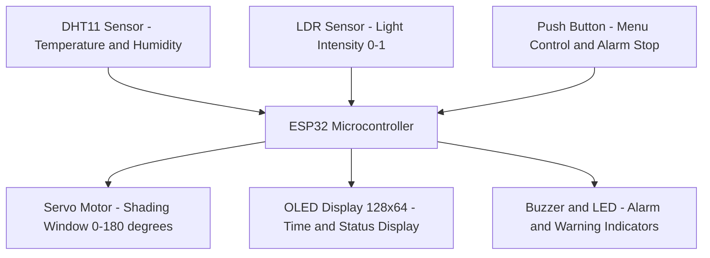
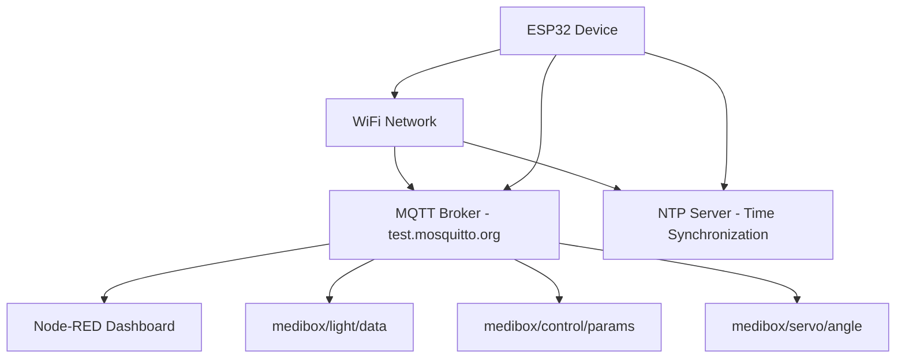
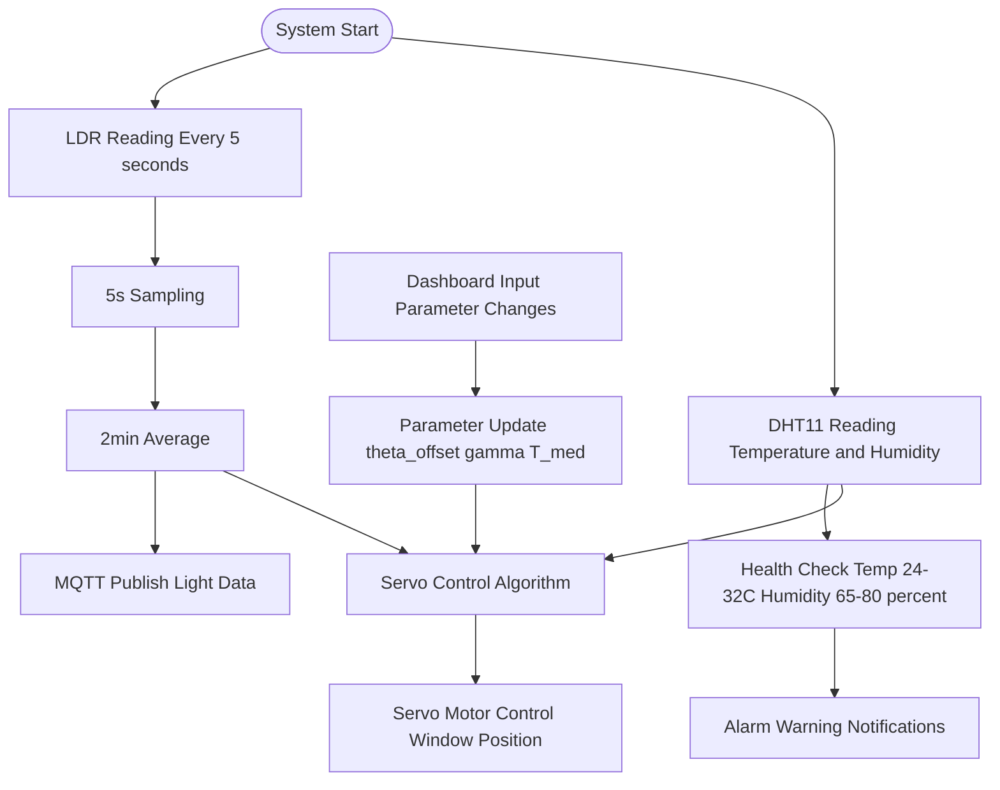
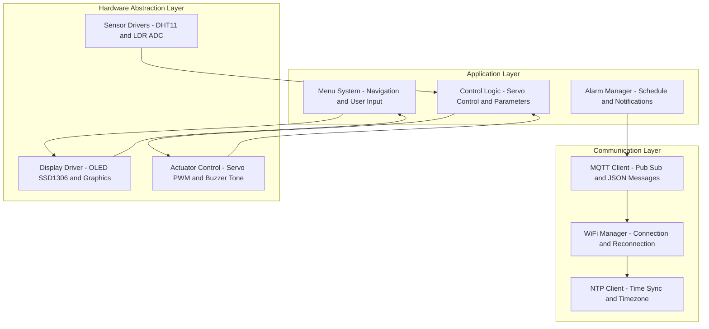

# Smart Medibox 💊

An IoT-based medication management system that assists users in managing their medication schedules effectively while monitoring environmental conditions for optimal medicine storage.

## 🎯 Project Overview

The Smart Medibox is an embedded systems project developed as part of the EN2853: Embedded Systems and Applications course. This device combines medication scheduling, environmental monitoring, and automated storage condition management to ensure medicines are stored and taken properly.

## ✨ Features

### Core Functionality 
- **Time Management**: Fetch current time from NTP server with timezone configuration
- **Alarm System**: Set up to 2 alarms with snooze functionality
- **Menu Navigation**: Interactive menu system for device configuration
- **Environmental Monitoring**: Temperature and humidity monitoring with health warnings
- **Visual Display**: OLED display for time, menu, and system status

### Advanced Features 
- **Light Intensity Monitoring**: Real-time light level measurement using LDR sensor
- **Automated Shading System**: Servo-controlled sliding window for optimal light conditions
- **IoT Dashboard**: Node-RED based web dashboard for remote monitoring and control
- **MQTT Communication**: Real-time data transmission to cloud dashboard
- **Configurable Parameters**: User-adjustable sampling rates and control parameters

## 🔧 Hardware Components

- **ESP32 Development Board**: Main microcontroller
- **OLED Display**: For local interface and information display
- **DHT11 Sensor**: Temperature and humidity measurement
- **LDR (Light Dependent Resistor)**: Light intensity monitoring
- **Servo Motor**: Automated shading window control
- **Push Button**: User interaction and alarm control
- **Buzzer**: Audio notifications for alarms and warnings
- **LED**: Visual status indicators

## 📐 System Architecture
### Hardware Layer

### Communication Layer

### Data Flow Architecture

### Software Architecture

## 🧮 Key Algorithms

### Servo Motor Control Algorithm
The shaded sliding window position is calculated using the following equation:

$$
\theta = \theta_{\text{offset}} + (180 - \theta_{\text{offset}}) \times I \times \gamma \times \ln\left(\frac{t_s}{t_u}\right) \times \left(\frac{T}{T_{\text{med}}}\right)
$$

### Where:
- $\theta$ : Motor angle (0–180°)  
- $\theta_{\text{offset}}$ : Minimum angle (default: 30°)  
- $I$ : Light intensity (range: 0–1)  
- $\gamma$ : Controlling factor (default: 0.75)  
- $t_s$ : Sampling interval (seconds)  
- $t_u$ : Sending interval (seconds)  
- $T$ : Measured temperature (°C)  
- $T_{\text{med}}$ : Ideal storage temperature (default: 30°C)

### Data Processing
- **LDR Sampling**: Every 5 seconds (configurable)
- **Data Averaging**: 2-minute rolling average (configurable)
- **Health Monitoring**: 
  - Temperature: 24°C ≤ T ≤ 32°C
  - Humidity: 65% ≤ H ≤ 80%

## 🌐 Dashboard Features

### Light Monitoring Group
- Real-time light intensity gauge (0-1 scale)
- Historical data visualization chart
- Configurable sampling interval slider
- Configurable sending interval slider

### Environmental Control Group
- Minimum angle adjustment (0-120°)
- Controlling factor adjustment (0-1)
- Ideal storage temperature setting (10-40°C)

**Pankaja Balasooriya**  
Index No: 220054N
EN2853: Embedded Systems and Applications  
University of Moratuwa

## 📞 Contact

For questions or suggestions, please contact balasooriyabapi.22@uom.lk.

---
