# Smart Medibox 💊

An IoT-based medication management system that assists users in managing their medication schedules effectively while monitoring environmental conditions for optimal medicine storage.

## 🎯 Project Overview

The Smart Medibox is an embedded systems project developed as part of the EN2853: Embedded Systems and Applications course. This device combines medication scheduling, environmental monitoring, and automated storage condition management to ensure medicines are stored and taken properly.

## ✨ Features

### Core Functionality 
- **Time Management**: Fetch current time from NTP server with timezone configuration
- **Alarm System**: Set up to 2 alarms with snooze functionality
- **Menu Navigation**: Interactive menu system for device configuration
- **Environmental Monitoring**: Temperature and humidity monitoring with health warnings
- **Visual Display**: OLED display for time, menu, and system status

### Advanced Features 
- **Light Intensity Monitoring**: Real-time light level measurement using LDR sensor
- **Automated Shading System**: Servo-controlled sliding window for optimal light conditions
- **IoT Dashboard**: Node-RED based web dashboard for remote monitoring and control
- **MQTT Communication**: Real-time data transmission to cloud dashboard
- **Configurable Parameters**: User-adjustable sampling rates and control parameters

## 🔧 Hardware Components

- **ESP32 Development Board**: Main microcontroller
- **OLED Display**: For local interface and information display
- **DHT11 Sensor**: Temperature and humidity measurement
- **LDR (Light Dependent Resistor)**: Light intensity monitoring
- **Servo Motor**: Automated shading window control
- **Push Button**: User interaction and alarm control
- **Buzzer**: Audio notifications for alarms and warnings
- **LED**: Visual status indicators

## 📐 System Architecture

### Hardware Layer

```mermaid
graph TB
    ESP32[ESP32 Microcontroller]
    
    %% Input Sensors
    DHT11[DHT11 SensorTemperature & Humidity]
    LDR[LDR SensorLight Intensity 0-1]
    Button[Push ButtonMenu Control & Alarm Stop]
    
    %% Output Actuators
    Servo[Servo MotorShading Window 0-180°]
    OLED[OLED Display 128x64Time & Status Display]
    Buzzer[Buzzer & LEDAlarm & Warning Indicators]
    
    %% Connections
    DHT11 --> ESP32
    LDR --> ESP32
    Button --> ESP32
    
    ESP32 --> Servo
    ESP32 --> OLED
    ESP32 --> Buzzer
    
    %% Styling
    classDef sensor fill:#e1f5fe,stroke:#0277bd,stroke-width:2px
    classDef actuator fill:#f3e5f5,stroke:#7b1fa2,stroke-width:2px
    classDef controller fill:#e8f5e8,stroke:#2e7d32,stroke-width:2px
    
    class DHT11,LDR,Button sensor
    class Servo,OLED,Buzzer actuator
    class ESP32 controller
```


### Communication Layer
```mermaid
graph TD
    ESP32[ESP32 Device]
    WiFi[WiFi Network]
    MQTT[MQTT Brokertest.mosquitto.org]
    NTP[NTP ServerTime Synchronization]
    NodeRED[Node-RED Dashboard]
    
    ESP32 |WiFi Connection| WiFi
    WiFi --> MQTT
    WiFi --> NTP
    
    MQTT |MQTT Protocol| NodeRED
    ESP32 |Publish/Subscribe| MQTT
    ESP32 |Time Sync| NTP
    
    %% MQTT Topics
    MQTT -.->|medibox/light/data| Topic1[Light Data]
    MQTT -.->|medibox/control/params| Topic2[Control Parameters]
    MQTT -.->|medibox/servo/angle| Topic3[Servo Angle]
    
    %% Styling
    classDef network fill:#fff3e0,stroke:#f57c00,stroke-width:2px
    classDef device fill:#e8f5e8,stroke:#2e7d32,stroke-width:2px
    classDef topic fill:#fce4ec,stroke:#c2185b,stroke-width:1px
    
    class WiFi,MQTT,NTP,NodeRED network
    class ESP32 device
    class Topic1,Topic2,Topic3 topic
```

### Data Flow Architecture

```mermaid
graph TD
    Start([System Start])
    
    %% Sensor Data Collection
    LDR_Read[LDR ReadingEvery 5 seconds]
    DHT_Read[DHT11 ReadingTemperature & Humidity]
    
    %% Data Processing
    LDR_Sample[5s Sampling]
    LDR_Avg[2min Average]
    Health_Check[Health CheckTemp: 24-32°CHumidity: 65-80%]
    
    %% Control Algorithm
    Control_Algo[Servo Control Algorithmθ = θ_offset + 180-θ_offset × I × γ × ln ts/tu × T/T_med]
    
    %% Outputs
    MQTT_Pub[MQTT PublishLight Data]
    Servo_Control[Servo Motor ControlWindow Position]
    Alarm_Warning[Alarm/WarningNotifications]
    
    %% Dashboard Input
    Dashboard_Input[Dashboard InputParameter Changes]
    Param_Update[Parameter Updateθ_offset, γ, T_med]
    
    Start --> LDR_Read
    Start --> DHT_Read
    
    LDR_Read --> LDR_Sample
    LDR_Sample --> LDR_Avg
    LDR_Avg --> MQTT_Pub
    
    DHT_Read --> Health_Check
    Health_Check --> Alarm_Warning
    
    LDR_Avg --> Control_Algo
    DHT_Read --> Control_Algo
    Control_Algo --> Servo_Control
    
    Dashboard_Input --> Param_Update
    Param_Update --> Control_Algo
    
    %% Styling
    classDef process fill:#e3f2fd,stroke:#1976d2,stroke-width:2px
    classDef algorithm fill:#fff3e0,stroke:#f57c00,stroke-width:2px
    classDef output fill:#e8f5e8,stroke:#2e7d32,stroke-width:2px
    classDef input fill:#fce4ec,stroke:#c2185b,stroke-width:2px
    
    class LDR_Read,DHT_Read,LDR_Sample,LDR_Avg,Health_Check process
    class Control_Algo algorithm
    class MQTT_Pub,Servo_Control,Alarm_Warning output
    class Dashboard_Input,Param_Update input
```


## 🧮 Key Algorithms

### Servo Motor Control Algorithm
The shaded sliding window position is calculated using the following equation:

```
θ = θ_offset + (180 - θ_offset) × I × γ × ln(t_s/t_u) × (T/T_med)
```

Where:
- `θ`: Motor angle (0-180°)
- `θ_offset`: Minimum angle (default: 30°)
- `I`: Light intensity (0-1)
- `γ`: Controlling factor (default: 0.75)
- `t_s`: Sampling interval (seconds)
- `t_u`: Sending interval (seconds)
- `T`: Measured temperature (°C)
- `T_med`: Ideal storage temperature (default: 30°C)

### Data Processing
- **LDR Sampling**: Every 5 seconds (configurable)
- **Data Averaging**: 2-minute rolling average (configurable)
- **Health Monitoring**: 
  - Temperature: 24°C ≤ T ≤ 32°C
  - Humidity: 65% ≤ H ≤ 80%

## 🌐 Dashboard Features

### Light Monitoring Group
- Real-time light intensity gauge (0-1 scale)
- Historical data visualization chart
- Configurable sampling interval slider
- Configurable sending interval slider

### Environmental Control Group
- Minimum angle adjustment (0-120°)
- Controlling factor adjustment (0-1)
- Ideal storage temperature setting (10-40°C)

## 🚀 Getting Started

### Prerequisites
- Arduino IDE with ESP32 board support
- Node-RED installation
- MQTT broker access (test.mosquitto.org)
- Required Arduino libraries:
  - WiFi
  - NTPClient
  - DHT sensor library
  - Servo library
  - SSD1306 (OLED display)
  - PubSubClient (MQTT)

### Installation

1. **Clone the repository**
   ```bash
   git clone https://github.com/yourusername/smart-medibox.git
   cd smart-medibox
   ```

2. **Hardware Setup**
   - Connect components according to the circuit diagram
   - Update pin configurations in the code if needed

3. **Software Configuration**
   - Update WiFi credentials in the Arduino code
   - Configure MQTT broker settings
   - Import Node-RED flow from the provided JSON file

4. **Upload and Run**
   - Upload the Arduino sketch to ESP32
   - Deploy the Node-RED flow
   - Access the dashboard through Node-RED interface

## 📁 Project Structure

```
smart-medibox/
├── arduino/
│   └── medibox_main.ino          # Main Arduino sketch
├── node-red/
│   └── dashboard_flow.json       # Node-RED flow configuration
├── documentation/
│   ├── circuit_diagram.png       # Hardware connection diagram
│   └── demo_video.mp4            # Project demonstration
├── README.md                     # This file
└── LICENSE                       # Project license
```

## 🎥 Demo Video

A comprehensive demonstration video is included showing:
- System setup and configuration
- Real-time monitoring capabilities
- Dashboard interaction
- Code walkthrough and explanation

## 🏆 Assessment Criteria

This project was evaluated based on:
- **Technical Implementation** (80%): Sensor integration, MQTT communication, servo control
- **User Interface** (10%): Dashboard design and functionality
- **Code Quality** (10%): Documentation, structure, and creativity

## 🔮 Future Enhancements

- Mobile app integration
- Multiple medication compartments
- Voice notifications
- Cloud data storage and analytics
- Integration with healthcare providers
- Advanced scheduling algorithms

## 🤝 Contributing

This project was developed as part of an academic assignment. Feel free to fork and enhance the functionality for your own projects.

## 📜 License

This project is licensed under the MIT License - see the [LICENSE](LICENSE) file for details.

## 👨‍💻 Author

**John Doe**  
Index No: XXXXX  
EN2853: Embedded Systems and Applications  
University of Moratuwa

## 📞 Contact

For questions or suggestions, please open an issue in this repository or contact [your-email@example.com].

---

*This project demonstrates the integration of embedded systems, IoT technologies, and user interface design to create a practical healthcare solution.*